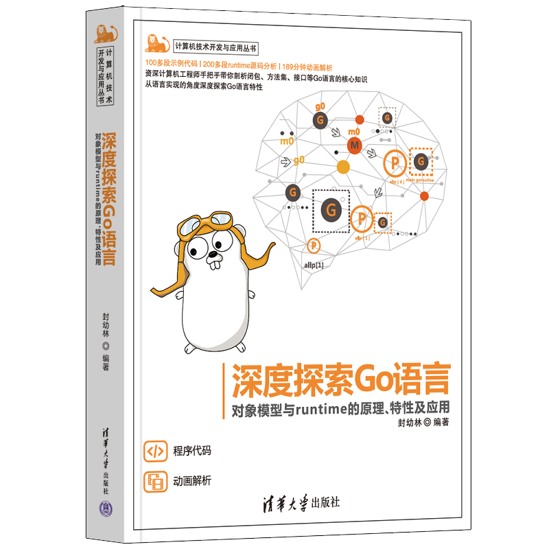

# 《深度探索Go语言》

本书主要讲解了Go语言一些关键特性的实现原理，Nicklaus Wirth大师曾经说过：算法+数据结构=程序，语言特性的实现也不外乎就是数据结构+代码逻辑。

全书共分为四个部分：第一部分是基础特性（第1、2、3章），第二部分是对象模型（第4、5章），第三部分是调度系统（第6、7章），第四部分是内存管理（第8、9章）。书中主要内容包括：指针、函数栈帧、调用约定、变量逃逸、Function Value、闭包、defer、panic、方法、Method Value、组合式继承、接口、类型断言、反射、goroutine、抢占式调度、同步、堆和栈的管理，以及GC等。

书中包含大量的探索示例和源码分析，在学会应用的同时还能了解实现原理。书中绝大部分代码都是用Go语言实现，还有少部分使用汇编语言，都可以使用Go官方SDK直接编译。探索过程循序渐进条理清晰，用到的工具也都是SDK自带，方便读者亲自上手实践。

本书适合Go语言的初学者，在学习语言特性的同时了解其实现原理。更适合有一定的Go语言应用基础，想要深入研究底层原理的技术人员。同样适合有一些其他编程语言基础，想要转学Go语言的开发者。

本书在[京东](https://item.jd.com/13391373.html)、[天猫](https://detail.tmall.com/item.htm?id=683938577791)和[当当](http://product.dangdang.com/29462109.html)等各大电商平台有售。读者如果有任何疑问，欢迎微信搜索KylinLabs添加作者好友，加入幼麟实验室交流群。